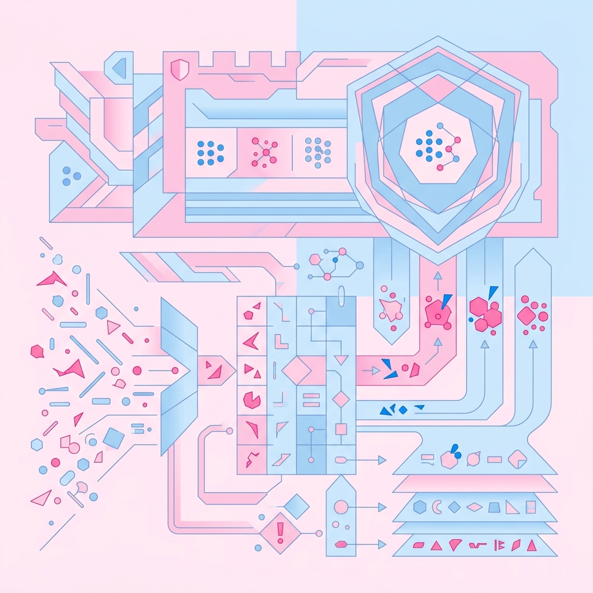

# 🔐 VulnPriority — CISO-Grade Vulnerability Prioritization

A multi-agent WAT (Workflows, Agents, Tools) pipeline that enriches raw CVE IDs with threat intelligence from 6 free public sources and produces prioritized, executive-ready patch guidance — so your team fixes the right vulnerabilities first.



---

## 🔍 The Problem

Security teams receive hundreds of CVE alerts every sprint. CVSS scores alone are a poor triage signal — a CVSS 9.8 vulnerability that has no public exploit and zero real-world exploitation is lower priority than a CVSS 7.5 that is actively being used in ransomware campaigns. Without context, teams waste remediation cycles on theoretical risk while real threats slip through.

Common pain points:
- Raw CVSS scores don't reflect actual exploitation likelihood
- Manual lookups across NVD, KEV, ExploitDB, and EPSS take hours per batch
- CISO reports require plain-language summaries, not JSON dumps
- No single tool correlates MITRE ATT&CK techniques with patch urgency

---

## ✅ The Solution

VulnPriority is a 7-phase enrichment and scoring pipeline that:

1. Takes a plain-text list of CVE IDs as input
2. Pulls authoritative data from 6 free public sources in parallel
3. Calculates a **composite priority score (0–100)** that weights real-world exploitation over theoretical severity
4. Produces a **CISO-ready HTML report** with patch timelines and remediation recommendations
5. Optionally exports a live **Google Sheets dashboard** for team collaboration

All data sources are free. No vendor lock-in. No SaaS required.

---

## ✨ Key Features

- **6 enrichment sources** — NVD, CISA KEV, EPSS, ExploitDB, OSV.dev, MITRE ATT&CK
- **Composite scoring formula** — EPSS-weighted, KEV-boosted, exploit-aware (0–100 scale)
- **7 specialized AI subagents** — each phase handled by a domain-specific Claude agent
- **CISO-grade HTML report** — executive summaries, patch timelines, ATT&CK technique mapping
- **Google Sheets export** — shareable live dashboard for security operations teams
- **Graceful degradation** — one blocked source never stops the pipeline
- **Full audit trail** — every scoring decision logged to `.tmp/audit_log.jsonl`
- **Fast mode** — skip slow optional steps for quick triage (`--skip-exploitdb --skip-attack`)
- **Rate-limit safe** — configurable delays with NVD API key support for 10× speed boost

---

## 🛡️ What It Analyzes

Each CVE is scored across five threat dimensions:

| Dimension | Source | Weight |
|-----------|--------|--------|
| Base severity | NIST NVD (CVSS v3) | 30% |
| Exploitation probability | FIRST.org EPSS | 35% |
| Active exploitation status | CISA KEV Catalog | +20 pts |
| Public exploit / PoC availability | Exploit-DB | +15 / +8 pts |
| Ransomware association | CISA KEV ransomware flag | +10 pts |

Additional context enrichment:
- **CWE classification** — weakness category from NVD
- **Affected package versions** — from OSV.dev
- **MITRE ATT&CK techniques** — mapped via the STIX enterprise bundle

---

## 🔄 How It Works

```
1. Input       →  Plain-text CVE list (one ID per line)
2. Validate    →  Format check, deduplication, batch sizing
3. Enrich      →  NVD + OSV (CVSS, CWE, affected versions)
4. Threat Intel→  KEV + EPSS + ExploitDB (real-world exploitation context)
5. ATT&CK Map  →  MITRE technique/tactic correlation
6. Score       →  Composite 0–100 score + patch timeline category
7. Report      →  HTML report + optional Google Sheets export
```

Each phase writes to `.tmp/` so any failed step can be retried without re-running the full pipeline.

---

## 🏗️ Architecture

This project follows the **WAT framework** (Workflows, Agents, Tools):

**Layer 1 — Workflows** (`workflows/`)
Markdown SOPs define what each phase does, which tools to call, and how to handle failures.

**Layer 2 — Agents** (`.claude/agents/`)
Seven specialized Claude subagents each own one pipeline domain: intake, research, threat intel, enrichment, scoring, recommendations, and audit.

**Layer 3 — Tools** (`tools/`)
Deterministic Python CLI scripts that do the actual API calls, parsing, and file I/O. Each script is independently testable and accepts argparse arguments.

```
CVE Input → cve-intake-agent → vuln-research-agent → threat-intel-agent
         → context-enrichment-agent → scoring-agent → recommendation-agent
         → audit-agent → HTML Report
```

---

## 🛠️ Tech Stack

| Layer | Technology |
|-------|-----------|
| Pipeline orchestration | Python 3.10+ |
| AI agents | Claude claude-sonnet-4-6 via Claude Code |
| NVD enrichment | NIST NVD API v2 (`requests`) |
| Threat intelligence | CISA KEV, FIRST.org EPSS, ExploitDB (BeautifulSoup) |
| ATT&CK mapping | MITRE STIX bundle (`stix2`) |
| Report generation | Jinja2 HTML templates |
| Sheets export | Google Sheets API v4 (`google-auth`, `gspread`) |
| Data validation | TypedDict + runtime checks |

---

## 🚀 Installation

### Prerequisites

- Python 3.10+
- pip
- (Optional) NVD API key — free at [nvd.nist.gov](https://nvd.nist.gov/developers/request-an-api-key) — makes the pipeline ~10× faster

### Steps

```bash
# 1. Clone the repo
git clone https://github.com/arunpushkar-dev/VulnPriority.git
cd VulnPriority

# 2. Install dependencies
pip install -r requirements.txt

# 3. Configure environment
cp .env.example .env
# Edit .env — add your NVD_API_KEY (optional but recommended)

# 4. Create your CVE input file
cat > cves.txt << 'EOF'
CVE-2021-44228
CVE-2024-3400
CVE-2022-30190
CVE-2023-44487
CVE-2020-1472
EOF

# 5. Run the pipeline
python main.py --input cves.txt --output html
```

Your report will be in `reports/`.

---

## 📖 Usage Guide

### Basic Run

```bash
python main.py --input cves.txt --output html
```

### With NVD API Key (recommended)

```bash
python main.py --input cves.txt --output html --nvd-api-key YOUR_KEY
```

### Fast Triage Mode

```bash
python main.py --input cves.txt --output html --skip-exploitdb --skip-attack
```

### Export to Google Sheets

```bash
python main.py --input cves.txt --output both --title "Q2 2026 Vuln Assessment" --email your@company.com
```

### Reading the Report

The HTML report contains:
- **Executive summary** — score distribution, top risks, recommended actions
- **CVE detail cards** — per-vulnerability scoring breakdown, ATT&CK techniques, patch guidance
- **Patch timeline table** — grouped by 24h / 7-day / 30-day / 90-day urgency

---

## ⚙️ Configuration

All configuration lives in `.env`:

| Variable | Required | Description |
|----------|----------|-------------|
| `NVD_API_KEY` | Optional | Raises NVD rate limit from 5/30s to 50/30s. ~10× speed improvement. |
| `GOOGLE_CREDENTIALS_PATH` | Optional | Path to `credentials.json` for Google Sheets export. |
| `EXPLOITDB_USER_AGENT` | Optional | Custom UA string for ExploitDB scraping. |

### CLI Options

```
python main.py --input FILE --output html|sheets|both
  --title TEXT              Custom report title
  --nvd-api-key KEY         NVD API key
  --skip-exploitdb          Skip ExploitDB scraping
  --skip-attack             Skip MITRE ATT&CK mapping (saves 30s+ on first run)
  --report-dir DIR          Custom output directory (default: ./reports)
  --no-cache                Force re-download of all cached data
  --logo PATH               Embed org logo in HTML report
  --email EMAIL             Share Sheets output with this email
  --verbose                 Show full tool output
```

### Google Sheets Setup

1. Go to [Google Cloud Console](https://console.cloud.google.com/)
2. Create a project → Enable **Google Sheets API** and **Google Drive API**
3. Create OAuth 2.0 credentials → Download as `credentials.json`
4. Place `credentials.json` in the project root
5. First run opens a browser for authorization; `token.json` is saved for future runs

---

## 📸 Screenshots


> Full screenshots of the HTML report, scoring breakdown, and Google Sheets export are available in `screenshots/` after running the pipeline.

---

## 🔌 API Reference

Individual tools can be called directly as CLI scripts for debugging or custom integration:

```bash
# Validate and deduplicate a CVE list
python tools/validate_cves.py --input cves.txt --output .tmp/validated_cves.json

# Fetch NVD data for a single CVE
python tools/fetch_nvd.py --cve CVE-2021-44228 --output .tmp/nvd_raw/

# Check CISA KEV membership
python tools/fetch_kev.py --input .tmp/validated_cves.json --output .tmp/kev_results.json

# Get EPSS scores
python tools/fetch_epss.py --input .tmp/validated_cves.json --output .tmp/epss_raw/

# Calculate composite scores
python tools/calculate_score.py --input .tmp/enriched/ --output .tmp/scored/

# Generate HTML report
python tools/generate_report.py --input .tmp/recommendations/ --output reports/
```

Each script outputs JSON and exits with code `0` on success, `1` on fatal error.

---

## 📁 Project Structure

```
vuln-priority/
├── main.py                          # Pipeline orchestrator
├── shared_types.py                  # TypedDict definitions shared across tools
├── app.py                           # Optional Flask/FastAPI entry point
├── requirements.txt
├── .env.example                     # Config template (copy to .env)
├── test_cves.txt                    # Sample CVE list for testing
│
├── tools/                           # Deterministic Python CLI scripts
│   ├── validate_cves.py             # Phase 1: Format validation & dedup
│   ├── fetch_nvd.py                 # Phase 2: NIST NVD enrichment
│   ├── fetch_osv.py                 # Phase 2: OSV.dev package ranges
│   ├── fetch_kev.py                 # Phase 3: CISA KEV lookup
│   ├── fetch_epss.py                # Phase 3: FIRST.org EPSS scores
│   ├── fetch_exploitdb.py           # Phase 3: ExploitDB public exploit check
│   ├── fetch_attack.py              # Phase 4: MITRE ATT&CK mapping
│   ├── merge_enrichment.py          # Phase 4: Merge all enrichment sources
│   ├── calculate_score.py           # Phase 5: Composite priority scoring
│   ├── generate_recommendations.py  # Phase 6: CISO-language patch guidance
│   ├── generate_report.py           # Phase 7: HTML report generation
│   └── export_to_sheets.py          # Phase 7: Google Sheets export
│
├── workflows/                       # Markdown SOPs for each pipeline phase
│   ├── cve_intake.md
│   ├── vulnerability_research.md
│   ├── threat_intelligence.md
│   ├── context_enrichment.md
│   ├── scoring.md
│   ├── recommendation.md
│   └── report_generation.md
│
├── .claude/agents/                  # Claude subagent definitions
│   ├── cve-intake-agent.md
│   ├── vuln-research-agent.md
│   ├── threat-intel-agent.md
│   ├── context-enrichment-agent.md
│   ├── scoring-agent.md
│   ├── recommendation-agent.md
│   └── audit-agent.md
│
├── templates/
│   └── report.html.j2               # Jinja2 HTML report template
├── static/
│   └── index.html
├── .tmp/                            # Intermediate files — disposable, auto-regenerated
└── reports/                         # Final HTML reports — keep for audit
```

---

## 🤝 Contributing

Contributions are welcome. High-value areas:

- **New enrichment sources** — add a `tools/fetch_<source>.py` and update `merge_enrichment.py`
- **Scoring formula improvements** — document rationale in `workflows/scoring.md` and open an issue first
- **Report template improvements** — `templates/report.html.j2` uses standard Jinja2
- **Site adapters / export targets** — e.g., Splunk, JIRA ticket creation, Slack alerts

**Scope rules:**
- Do not modify scoring weights without a linked issue and community discussion
- All new tools must accept `--input` / `--output` CLI args and write JSON
- Secrets never leave `.env`

---

## 🗺️ Roadmap

| Priority | Feature |
|----------|---------|
| High | VEX (Vulnerability Exploitability eXchange) document output |
| High | Batch progress bar and ETA display |
| Medium | SBOM input support (CycloneDX / SPDX → CVE extraction) |
| Medium | Slack / Teams alert integration for Critical-scored CVEs |
| Low | JIRA ticket auto-creation for patch tracking |
| Low | Historical trend comparison between report runs |
| Low | Custom scoring weight profiles per org policy |

---

## 🔒 Security Considerations

- **No raw CVE data is stored externally** — all processing is local
- **API keys stay in `.env`** — never committed, never logged
- **ExploitDB scraping uses configurable delays** — respects `robots.txt` spirit
- **NVD rate limits are enforced in code** — the pipeline won't get your IP blocked
- **Audit log is append-only** — `.tmp/audit_log.jsonl` records every scoring decision for compliance
- **Google Sheets OAuth** — uses short-lived tokens; revoke anytime from your Google Account

---

## 📄 License

MIT License — see [LICENSE](LICENSE) for details.

---

## 👤 Author / Maintainer

**Arun Pushkar**
GitHub: [@arunpushkar-dev](https://github.com/arunpushkar-dev)

For security issues or responsible disclosure, open a private GitHub issue.

---

## ❓ FAQ

**Does this send my CVE data to any cloud service?**
Only to the public APIs you configure (NVD, CISA, FIRST.org, ExploitDB, OSV.dev). No proprietary backend. Google Sheets export is opt-in.

**Can I run it fully offline?**
Partially — if you have cached `.tmp/` files from a previous run, scoring and report generation work offline. The enrichment phase requires internet access.

**How accurate are the scores?**
The formula is deterministic and based on publicly available data. EPSS scores update daily on FIRST.org; re-run with `--no-cache` to get fresh values.

**What if ExploitDB blocks scraping?**
Use `--skip-exploitdb`. The pipeline continues with a 0-point exploit modifier. The score will be conservative (safer to act on, not riskier).

**Is this suitable for enterprise use?**
Yes — the HTML report and Google Sheets output are designed for CISO-level presentation. For org-wide deployment, add your logo with `--logo` and set up a shared Sheets workspace.

**Which Claude model does this use?**
The AI agent layer uses `claude-sonnet-4-6` via Claude Code. You can swap the model in `.claude/agents/*.md` definitions.

---

## ⚡ Quick Start (TL;DR)

```bash
git clone https://github.com/arunpushkar-dev/VulnPriority.git && cd VulnPriority
pip install -r requirements.txt
echo "CVE-2021-44228\nCVE-2024-3400\nCVE-2022-30190" > cves.txt
python main.py --input cves.txt --output html
# Open reports/*.html in your browser
```
